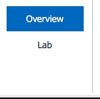

# Intro to Azure Container Service

## Expected outcome

In this lab, you will prepare your workstation VM for working with ACS and Kubernetes. You will need to have an RDP client on your local PC and access to the web to launch our Hackfest Workstation VM.

## How to

1. Using your browser go to the Registration Site listed in your classroom.
    * Please make sure you use a valid work email as it will not allow for commercial e-mail domains.
        * 
    * Once you select submit, **DO NOT CLOSE THE BROWSER**.
    * On the Lab and Overview page, navigate to the Lab tab and then select Launch Lab
        * 
        * 
    * The Lab will begin to deploy. **DO NOT CLOSE THE BROWSER**. This will take some time but the needed credentials will be presented on the page when the provisioning is complete.
        * 
    * Your credentials will be emails to your signup email address as well as presented on the screen
        * 

2. Launch your RDP client of choice and enter the url of the jump-box provided for you. Use the AdminUsername and AdminPassword provided in your email
    *  
    * It may take a minute or so at first launch to get the desktop to present. This is normal at first log in.

3. Access Terminal and Update CLI.
    * Access the Terminal application on your VM desktop. Applications -> Favorites -> Terminal 
    * It is good practice to always update your azure cli to ensure new features, functionality and bug fixes have been applied.
    * ``sudo yum update azure-cli``  

4. Log in to your student Azure account via the CLI
    * Use ``az login`` to login to your lab Azure Account. You will be asked to visit ``https://aka.ms/devicelogin`` and use the provided code to authenticate. Use the credentials provided in your e-mail/Lab Provisioning page.
        *    
    * The password is a onetime password and must be changed at first signing in.
    * Your terminal windows will update with a JSON output of your subscription confirming the login has worked.

5. List your ACS clusters
    * ``az acs list -o table``
    * The result should be a table with your ACS cluster name and region as well as location.
        * 

6. Get your Kubernetes Config file from ACS
    * ``az acs kubernetes get-credentials -n _clustername_from_table_ -g _resourcegroup_from_table_``
        * 

7. Verify you can now access your Kubernetes Cluster.
    * ``kubectl get nodes``
        *  

8. Explore the Kubernetes dashboard
    * In the terminal type ``kubectl proxy``
    * In a web browser open ``http://127.0.0.1:8001/api/v1/proxy/namespaces/kube-system/services/kubernetes-dashboard/#!/cluster?namespace=default``
    * Explore different resources in the dashboard
    * You can use the dashboard throughout the challenges to visualize resources you deploy

9. In your terminal git clone the repo for this Hackfest
    * ``git clone https://github.com/dstrebel/internal-hackfest.git``
    * cd into the ``/internal-hackfest/challenges`` directory 

## Advanced areas to explore

1. If you have time, explore deploying a Kubernetes Cluster using the [ACS-Engine Open Source](https://github.com/Azure/acs-engine) project. 
2. Deploy a cluster using acs-engine with advanced options such as custom Network Range, Azure CNI or Calico Network Policy. 
